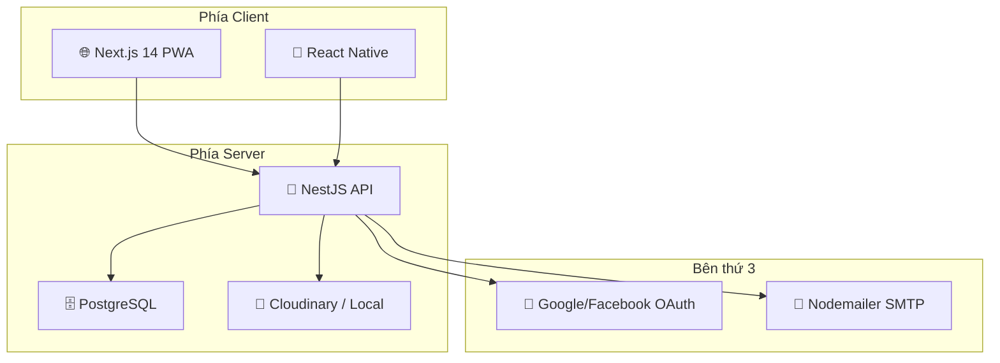

# Báo Giá Dự Án Web Truyện HungYeu

## 1. Tổng Quan Quy Mô Dự Án

### Thống Kê Code

| Thành phần | Số file | Dung lượng | Chi tiết |
|---|---|---|---|
| **Backend** (NestJS) | 120 files | 390 KB | 23 modules, 34 DB models |
| **Frontend** (Next.js) | 139 files | 1,380 KB | 26+ pages, 12 admin pages |
| **Mobile** (React Native) | 30 files | 82 KB | Đang phát triển |
| **Database** (Prisma) | 781 dòng schema | 24 KB | 34 models, PostgreSQL |
| **Tổng** | **289+ files** | **~1.85 MB** | Full-stack monorepo |

### Kiến Trúc Hệ Thống

---

## 2. Phân Tích Chi Tiết Từng Module

### Module 1: Hệ thống Authentication & Authorization
| Hạng mục | Chi tiết |
|---|---|
| Đăng ký / Đăng nhập email + mật khẩu | JWT + Refresh Token |
| OAuth (Google, Facebook) | Passport strategies |
| Phân quyền (Admin, Author, User) | Guards, Decorators |
| Xác thực email | Token-based verification |
| Brute-force protection | Login attempt tracking |
| **Ước tính** | **15-20 man-days** |

### Module 2: Quản lý Truyện (Stories)
| Hạng mục | Chi tiết |
|---|---|
| CRUD truyện (tạo, sửa, xoá) | Full CRUD + slug |
| Upload ảnh bìa + nén ảnh | Canvas compression |
| Phân loại thể loại, tags | Many-to-many relations |
| Trạng thái (Draft, Published, Completed) | State machine |
| Quốc gia (Trung, Việt, Hàn, Nhật) | Filter system |
| Bộ lọc + Tìm kiếm nâng cao | Full-text search |
| **Ước tính** | **20-25 man-days** |

### Module 3: Quản lý Chương (Chapters)
| Hạng mục | Chi tiết |
|---|---|
| Rich Text Editor (Quill) | Custom toolbar |
| Chèn ảnh + Thư viện ảnh | Gallery modal |
| Điều chỉnh kích thước & canh lề ảnh | Custom resize toolbar |
| Nén ảnh trước upload | Client-side compression |
| Sắp xếp thứ tự chương | Drag & drop order |
| **Ước tính** | **15-20 man-days** |

### Module 4: Hệ thống Đọc Truyện
| Hạng mục | Chi tiết |
|---|---|
| Trang đọc chương (reader) | Responsive layout |
| Lịch sử đọc | Auto-tracking |
| Bookmark / theo dõi truyện | Follow system |
| Yêu thích (favorites) | Like system |
| Đánh giá + bình luận | Rating + nested comments |
| **Ước tính** | **15-20 man-days** |

### Module 5: Admin Panel
| Hạng mục | Chi tiết |
|---|---|
| Dashboard thống kê | Charts (Chart.js) |
| Quản lý người dùng | CRUD + role management |
| Quản lý truyện / chương | Approval workflow |
| Quản lý thể loại | CRUD categories |
| Quản lý bình luận | Moderation |
| Quản lý thông báo hệ thống | Create + broadcast |
| Cài đặt website | Dynamic settings |
| Quản lý trang tĩnh (CMS) | Liên hệ, giới thiệu... |
| **Ước tính** | **20-25 man-days** |

### Module 6: Hệ thống Quảng Cáo (Ads)
| Hạng mục | Chi tiết |
|---|---|
| Quản lý quảng cáo (Banner, Popup, Sidebar) | 3 types, 5 positions |
| Campaign management | Budget tracking |
| Impression / Click tracking | Analytics |
| Target audience | JSON-based rules |
| **Ước tính** | **10-15 man-days** |

### Module 7: Hệ thống Kinh Tế (Economy)
| Hạng mục | Chi tiết |
|---|---|
| Ví xu (UserWallet) | Balance management |
| Gói nạp xu (CoinPackage) | Price tiers |
| Mua chương trả phí | Purchase + unlock |
| Donate tác giả | Author tips |
| Lịch sử giao dịch | Transaction log |
| **Ước tính** | **15-18 man-days** |

### Module 8: Hệ thống Thông báo
| Hạng mục | Chi tiết |
|---|---|
| Thông báo hệ thống | Multi-type, priority |
| Đánh dấu đã đọc | Per-user tracking |
| Gửi email | Optional email delivery |
| Target theo role | Audience targeting |
| **Ước tính** | **8-10 man-days** |

### Module 9: PWA & Performance
| Hạng mục | Chi tiết |
|---|---|
| Service Worker | Offline support |
| Runtime caching (ảnh, fonts, API) | Workbox strategies |
| Image optimization (AVIF, WebP) | Next.js Image |
| SEO (sitemap, robots, meta) | Auto-generated |
| **Ước tính** | **8-10 man-days** |

### Module 10: Trang Tĩnh (CMS Pages)
| Hạng mục | Chi tiết |
|---|---|
| Giới thiệu, Liên hệ quảng cáo | Static pages |
| Bản quyền, Điều khoản, Privacy | Legal pages |
| Ủng hộ, Góp ý | Community pages |
| Đăng ký tác giả, Đối tác | Partner pages |
| **Ước tính** | **5-8 man-days** |

### Module 11: UI/UX & Responsive Design
| Hạng mục | Chi tiết |
|---|---|
| Dark/Light mode | Theme toggle |
| Responsive (Mobile-first) | TailwindCSS |
| Navigation + Layout system | Sidebar, header |
| Loading states, Error handling | Skeleton, toast |
| **Ước tính** | **15-20 man-days** |

### Module 12: Mobile App (React Native)
| Hạng mục | Chi tiết |
|---|---|
| Expo SDK setup | Cross-platform |
| Auth integration | Token-based |
| Story browsing + Reading | Core screens |
| *Đang phát triển cơ bản* | 30 files hiện tại |
| **Ước tính** | **25-35 man-days** |

---

## 3. Tổng Hợp Man-Day

| Module | Min (ngày) | Max (ngày) |
|---|---|---|
| 1. Authentication & Authorization | 15 | 20 |
| 2. Quản lý Truyện | 20 | 25 |
| 3. Quản lý Chương + Editor | 15 | 20 |
| 4. Hệ thống Đọc | 15 | 20 |
| 5. Admin Panel | 20 | 25 |
| 6. Hệ thống Quảng Cáo | 10 | 15 |
| 7. Hệ thống Kinh Tế | 15 | 18 |
| 8. Thông báo | 8 | 10 |
| 9. PWA & Performance | 8 | 10 |
| 10. Trang Tĩnh CMS | 5 | 8 |
| 11. UI/UX Design | 15 | 20 |
| 12. Mobile App | 25 | 35 |
| **Testing & QA** | 10 | 15 |
| **DevOps & Deploy** | 5 | 8 |
| | | |
| **TỔNG** | **186 ngày** | **249 ngày** |

---

## 4. Báo Giá Theo Thị Trường Việt Nam

### Phương án A: Freelancer (1 người)

| Hạng mục | Đơn giá | Thành tiền |
|---|---|---|
| 186-249 man-days × 1.5-2 triệu/ngày | 1.5-2 triệu | **279 - 498 triệu** |
| Thời gian hoàn thành | | 8-12 tháng |

### Phương án B: Team nhỏ (2-3 người)

| Vai trò | Số lượng | Lương/tháng | Thời gian | Chi phí |
|---|---|---|---|---|
| Fullstack Developer | 2 | 15-25 triệu | 4-6 tháng | 120-300 triệu |
| UI/UX Designer | 1 (part-time) | 8-12 triệu | 2 tháng | 16-24 triệu |
| PM/QA | 1 (part-time) | 10-15 triệu | 4-6 tháng | 40-90 triệu |
| **Tổng** | | | **4-6 tháng** | **176 - 414 triệu** |

### Phương án C: Agency / Công ty phần mềm

| Quy mô | Đơn giá | Thành tiền | Thời gian |
|---|---|---|---|
| Agency nhỏ | 3-4 triệu/man-day | 558 - 996 triệu | 3-4 tháng |
| Công ty vừa | 4-6 triệu/man-day | 744 - 1,494 triệu | 2-3 tháng |
| Công ty lớn | 6-10 triệu/man-day | 1,116 - 2,490 triệu | 2-3 tháng |

---

## 5. Báo Giá Đề Xuất (Giá Hợp Lý)

> [!IMPORTANT]
> Đây là mức giá tham khảo cho thị trường VN, dựa trên quy mô thực tế của dự án.

### Gói Cơ Bản (Không Mobile)
| Hạng mục | Chi phí |
|---|---|
| Backend + Frontend + Admin + CMS | 200 - 350 triệu |
| Database design + Setup | Bao gồm |
| Deploy lên VPS | Bao gồm |
| Bảo trì 3 tháng | Bao gồm |

### Gói Đầy Đủ (Bao gồm Mobile)
| Hạng mục | Chi phí |
|---|---|
| Tất cả module (12/12) | 300 - 500 triệu |
| App iOS + Android | Bao gồm |
| Database + Deploy | Bao gồm |
| Bảo trì 6 tháng | Bao gồm |

---

## 6. Chi Phí Vận Hành Hàng Tháng

| Hạng mục | Min | Max | Ghi chú |
|---|---|---|---|
| VPS (2GB RAM) | 120K | 300K | DigitalOcean/Vultr |
| Domain (.com) | 25K | 50K | Tính theo tháng |
| SSL | 0 | 0 | Let's Encrypt (miễn phí) |
| Cloudinary | 0 | 200K | Free tier 25GB |
| Email (SMTP) | 0 | 100K | Gmail free / Brevo |
| Backup | 0 | 50K | Auto script |
| **Tổng/tháng** | **~150K** | **~700K** | |
| **Tổng/năm** | **~1.8 triệu** | **~8.4 triệu** | |

---

## 7. So Sánh Với Thị Trường

| Platform tương đương | Giá thị trường | Dự án này |
|---|---|---|
| Web đọc truyện đơn giản | 50-100 triệu | — |
| **Web truyện + Admin + Economy** | **200-400 triệu** | **✅ Phù hợp** |
| Web truyện + Mobile + Monetization | 400-800 triệu | — |
| Nền tảng truyện lớn (như Wattpad clone) | 1-3 tỷ | — |

> [!NOTE]
> Dự án Web Truyện HungYeu có quy mô **trung bình-lớn** với 34 database models, hệ thống kinh tế (ví xu, mua chương, donate), quảng cáo, PWA, và đang phát triển mobile app. Giá trị hợp lý nằm trong khoảng **300-500 triệu VNĐ** cho gói đầy đủ.
